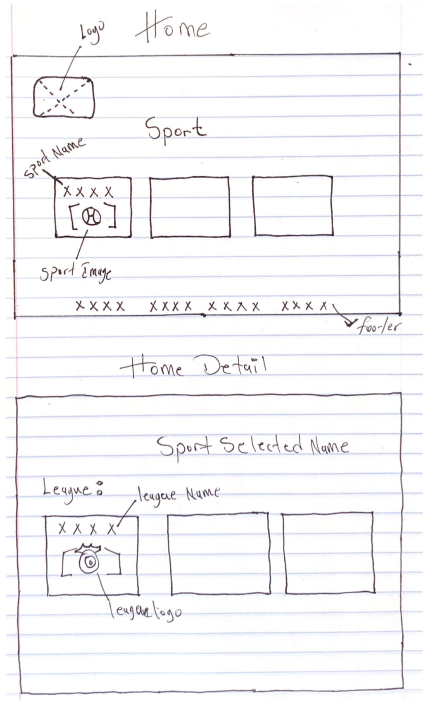

# [Sports Book Live](https://sportanalyst.herokuapp.com/)

## Description:
Sports Book is software that allows you to browse today's football games and track them under your account.

## Function:
- Account login & sign up
- Today's football matches
- Match predictions
- Save/delete match/s
- View saved matches

## Pages:
  1. Home page
  2. Detail page
  3. myAccount page

## Tech stack:
  - Python
  - Django
  - Javascript
  - HTML, CSS

## Resources:
  - [Football API](https://api-football-v1.p.rapidapi.com)
  - [Google Chart](https://canvasjs.com/assets/script/jquery.canvasjs.min.js)
  - [JS Chart](https://www.gstatic.com/charts/loader.js)
  - [Bootstrap](https://getbootstrap.com/)

## FrameWoork :

